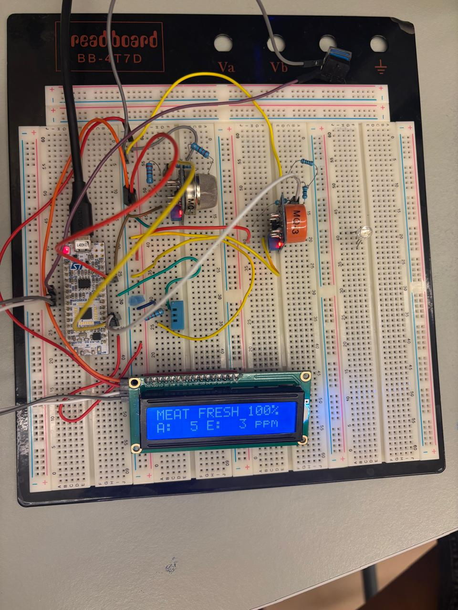
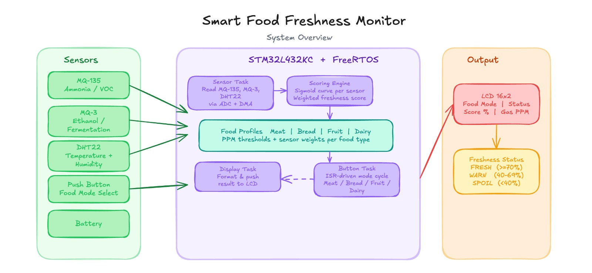
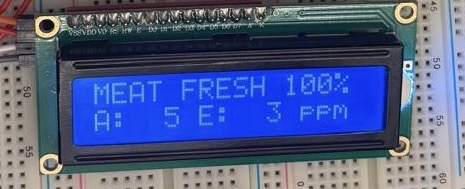
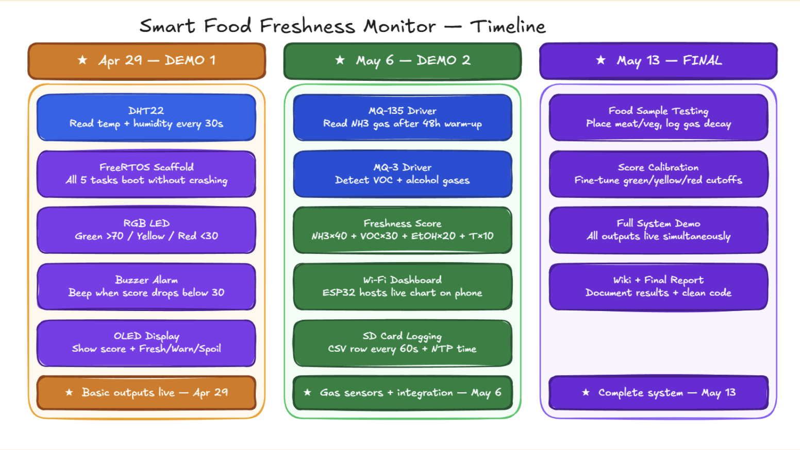

# Smart Food Freshness Monitor



An embedded system that detects food spoilage **before** it becomes visible or
smellable. The device continuously samples the gases that spoiling food
releases — ammonia, ethanol, and volatile organic compounds — together with
temperature and humidity, and computes a live **freshness score from 0 to
100**. When the score drops, the user is alerted on a 16×2 LCD showing the
live score, freshness label, and active food mode.

Built on the **STM32L432KC (NUCLEO-L432KC)** running **FreeRTOS (CMSIS-RTOS
v2)** at 80 MHz.

| Name       | GitHub                                       |
| ---------- | -------------------------------------------- |
| Amal Fouda | [amalfouda](https://github.com/amalfouda)    |
| Omar Saleh | [omaranwar1](https://github.com/omaranwar1)  |

---

## Features

- **Multi-gas sensing** — MQ-135 (NH₃/VOC) and MQ-3 (ethanol) read via ADC1
  with DMA circular buffer
- **Environmental sensing** — DHT22 temperature and humidity (1-Wire on PA5)
- **Four food profiles** — `MEAT`, `BREAD`, `FRUIT`, `DAIRY`, each with its
  own gas-weight table grounded in published food-science literature
- **Mode switching** — push button with interrupt-driven debounce cycles
  through the four profiles
- **Weighted freshness score** — sigmoid-based scoring against per-food
  fresh / borderline / spoiled thresholds, recomputed every 5 s
- **Live LCD output** — food mode, FRESH / WARN / SPOIL label, score %,
  and live PPM estimates for both gas sensors
- **FreeRTOS multitasking** — separate tasks for sensor read, scoring, LCD
  refresh, and button handling

---

## Folder Structure

```
Smart-Food-Freshness-Monitor/
├── README.md                        ← this file
├── .gitignore                       ← excludes Keil build artifacts + vendor HAL
├── embedded_project_new.ioc         ← STM32CubeMX configuration
├── .mxproject                       ← CubeMX project metadata
│
├── docs/
│   └── images/                      ← diagrams, wiring photos, timeline
│       ├── connections.png
│       ├── block-diagram.png
│       ├── timeline.png
│       └── lcd-demo.png
│
├── Core/
│   ├── Inc/                         ← public headers (CubeMX + app)
│   │   ├── main.h
│   │   ├── stm32l4xx_it.h           ← interrupt handlers
│   │   ├── stm32l4xx_hal_conf.h     ← HAL config
│   │   ├── FreeRTOSConfig.h         ← RTOS config
│   │   ├── dht22.h                  ← DHT22 driver API
│   │   ├── lcd_i2c.h                ← LCD (PCF8574) driver API
│   │   └── Food_Score.h             ← scoring + food-profile API
│   └── Src/                         ← CubeMX-generated + app sources
│       ├── main.c                   ← peripheral init + RTOS task definitions
│       ├── freertos.c               ← task bodies
│       ├── stm32l4xx_it.c           ← ISR implementations
│       ├── stm32l4xx_hal_msp.c      ← HAL MSP init
│       ├── stm32l4xx_hal_timebase_tim.c
│       └── system_stm32l4xx.c
│
└── MDK-ARM/                         ← Keil µVision project + app sources*
    ├── embedded_project_new.uvprojx ← Keil project file (open this in µVision)
    ├── embedded_project_new.uvoptx
    ├── startup_stm32l432xx.s        ← reset / vector table
    ├── dht22.c                      ← DHT22 1-Wire driver
    ├── lcd_i2c.c                    ← I²C LCD (PCF8574) driver
    └── Food_Score.c                 ← freshness scoring engine

* The three .c application files live under MDK-ARM/ because the Keil
  .uvprojx references them at that path; their public headers are still in
  Core/Inc/ so the standard CubeMX include layout is preserved.
```

> The `Drivers/` (STM32 HAL) and `Middlewares/` (FreeRTOS, etc.) folders are
> **intentionally excluded** from version control via `.gitignore` to keep
> the repo small. They are regenerated by STM32CubeMX from
> `embedded_project_new.ioc` — see the build instructions below.

---

## System Architecture



---

## Hardware

| Component       | Part                          | Notes                                  |
| --------------- | ----------------------------- | -------------------------------------- |
| MCU board       | NUCLEO-L432KC (STM32L432KC)   | 80 MHz, FreeRTOS                       |
| Gas sensor #1   | MQ-135                        | NH₃ / VOC — ADC1 channel              |
| Gas sensor #2   | MQ-3                          | Ethanol — ADC1 channel                 |
| T / RH sensor   | DHT22 (AM2302) 3-pin module   | 1-Wire on **PA5**, 3.3 V (on-board pull-up) |
| Display         | 16×2 LCD + PCF8574 I²C backpack | I²C1 (PB6/PB7)                       |
| User input      | Momentary push button         | EXTI interrupt, debounced              |
| Power           | 18650 Li-ion + TP4056 + MT3608 | Boosted to 5 V                         |

---

## Toolchain / Build Environment

- **IDE:** Keil µVision **MDK-ARM v5.38+** (Arm Compiler 6)
- **Configurator:** STM32CubeMX **6.10+** (for regenerating HAL / RTOS)
---

## Build & Run

### 1. Clone the repo

```bash
git clone https://github.com/amalfouda/Smart-Food-Freshness-Monitor.git
cd Smart-Food-Freshness-Monitor
```

### 2. Regenerate vendor libraries

The `Drivers/` and `Middlewares/` folders are gitignored. Generate them once:

1. Open **STM32CubeMX**.
2. `File → Load Project…` → select `embedded_project_new.ioc`.
3. Confirm the firmware package **STM32Cube FW_L4** is installed
   (`Help → Manage Embedded Software Packages`).
4. Click **`GENERATE CODE`**. CubeMX will populate `Drivers/` and
   `Middlewares/` next to `Core/` and `MDK-ARM/`. Choose **Keil MDK-ARM V5**
   as the toolchain when prompted.

### 3. Open the Keil project

1. Launch **Keil µVision 5**.
2. `Project → Open Project…` → `MDK-ARM/embedded_project_new.uvprojx`.
3. Verify the target device is **STM32L432KCUx** and the debugger is set to
   **ST-LINK Debugger** under `Project → Options → Debug`.

### 4. Build

- `Project → Build Target` (F7). A clean build produces an `.axf` /
  `.hex` under `MDK-ARM/embedded_project_new/`.

### 5. Flash

1. Connect the NUCLEO-L432KC over USB.
2. `Flash → Download` (F8) — the binary is programmed via ST-LINK.

### 6. Run

1. Power the board (USB or 18650 + boost).
2. The LCD should show the current food mode and `Initializing…`.
3. After self-calibration completes (~30 s in clean air), the live score and
   freshness label appear.
4. Press the user button to cycle through `MEAT → BREAD → FRUIT → DAIRY`.



---

## Freshness Scoring (summary)

```
score = 100 − Σ(sensor_spoilage × weight)
```

Each sensor's raw ADC count is passed through a **logistic (sigmoid)** curve
centred between the **fresh** and **borderline** PPM thresholds from the
per-food reference table. The weighted sum uses the literature-derived
profile for the active food mode:

| Food   | w_MQ135 | w_MQ3 | w_Temp | w_RH |
| ------ | ------- | ----- | ------ | ---- |
| Meat   | 0.50    | 0.15  | 0.25   | 0.10 |
| Bread  | 0.15    | 0.25  | 0.20   | 0.40 |
| Fruit  | 0.20    | 0.45  | 0.25   | 0.10 |
| Dairy  | 0.30    | 0.35  | 0.30   | 0.05 |

---

## Project Status

All subsystems working on hardware:

- MQ-135 + MQ-3 continuous ADC/DMA sampling
- DHT22 temperature / humidity reading correctly on PA5
- LCD live output (mode, label, score %, PPM, T/RH)
- Button-driven mode cycling with debounce
- 5 s scoring loop, validated across all four food modes
  (e.g. hand sanitizer drops `BREAD` to SPOIL while `MEAT` stays FRESH —
  matching the food-science rationale that ethanol is not a meat marker)

---

## Project Timeline



---

## References

1. Y. Xu *et al.*, "Integrated Smart Gas Tracking Device for Real-Time
   Monitoring Food Freshness," *Sensors*, 23(19):8109, 2023.
2. H. Jayan *et al.*, "Intelligent Gas Sensors for Food Safety and Quality
   Monitoring," *Foods*, 14(15):2706, 2025.
3. D. M. G. Preethichandra *et al.*, "Conducting Polymer Based Ammonia and
   H₂S Sensors for Detecting Food Spoilage," *Adv. Mater. Technol.*, 8:2200841,
   2022.